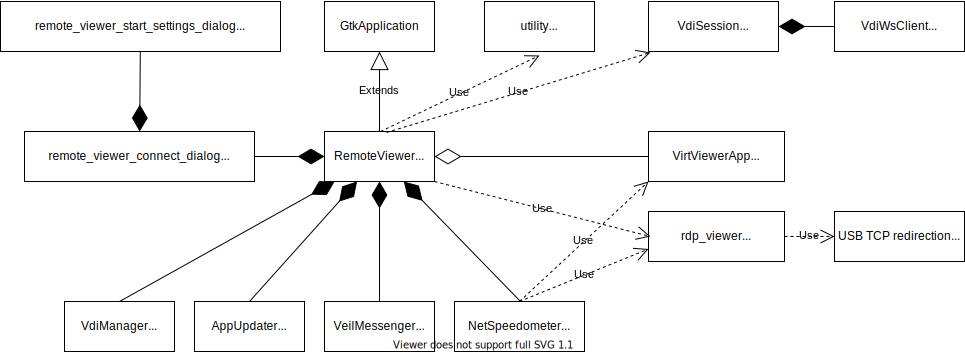

# VeiL Connect
Тонкий клиен VeiL VDI

## Таблица соответствия сборок с ОС

| ОС                 | Пакет   |
|--------------------|---------|
| Astra 1.6 Smolensk | stretch |
| Astra 2.12 Orel    | bionic  |
| Debian 9           | stretch |
| Debian 10          | buster  |
| Ubuntu 16.04       | xenial  |
| Ubuntu 18.04       | bionic  |
| Ubuntu 20.04       | focal   |
| Centos 7           |  el7    |
| Centos 8           |  el8    |
| Alt Linux 9        |  alt9   |


## Building on Debian 9
```
echo "deb http://deb.debian.org/debian stretch-backports main" | tee /etc/apt/sources.list.d/stretch-backports.list
apt-get update
apt-get install -y -q libhiredis-dev \
libspice-client-gtk-3.0-dev libjson-glib-dev libxml2-dev libsoup2.4-dev \
freerdp2-dev gcc cmake pkg-config libusb-1.0-0-dev libusbredirparser-dev

mkdir build
cd build
cmake -DCMAKE_BUILD_TYPE=Release ../
make
```
## Building on Debian 10 and Ubuntu 18.04 / 20.04
```
apt-get install libhiredis-dev libspice-client-gtk-3.0-dev libjson-glib-dev \
libxml2-dev libsoup2.4-dev freerdp2-dev gcc cmake pkg-config libusb-1.0-0-dev \
libusbredirparser-dev

mkdir build
cd build
cmake -DCMAKE_BUILD_TYPE=Release ../
make
```

## Building on Ubuntu 16.04
```
apt-get install libhiredis-dev \
libspice-client-gtk-3.0-dev libjson-glib-dev libxml2-dev libsoup2.4-dev \
gcc cmake pkg-config libusb-1.0-0-dev libusbredirparser-dev curl && \
sed -i 's/xenial/bionic/g' /etc/apt/sources.list && apt-get update && \
apt-get install freerdp2-dev cmake libspice-client-gtk-3.0-dev 

mkdir build
cd build
cmake -DCMAKE_BUILD_TYPE=Release ../
make
```

## Building on Centos 7
```
yum install -y epel-release
yum install -y rpmdevtools spice-gtk3-devel freerdp-devel json-glib-devel libsoup-devel \
libxml2-devel gcc cmake3 make gtk3-devel hiredis-devel usbredir-devel libusb-devel

mkdir build
cd build
cmake3 -DCMAKE_BUILD_TYPE=Release ../
make
```

## Building on Centos 8
```
yum install -y epel-release dnf-plugins-core
yum config-manager --set-enabled powertools
yum install -y rpmdevtools spice-gtk3-devel freerdp-devel json-glib-devel libsoup-devel \
libxml2-devel gcc cmake3 make gtk3-devel hiredis-devel usbredir-devel libusb-devel

mkdir build
cd build
cmake3 -DCMAKE_BUILD_TYPE=Release ../
make
```

## Building on Windows

- Установить MSYS2, следуя инструкциям https://www.gtk.org/docs/installations/windows


- Установить GTK3. Открыть MSYS2 терминал и выполнить:
```
pacman -S mingw-w64-x86_64-gtk3
```

- Установить инструментарий:
```
pacman -S mingw-w64-x86_64-toolchain base-devel
```

- Установить зависимости:
```
pacman -S mingw64/mingw-w64-x86_64-libsoup
pacman -S mingw64/mingw-w64-x86_64-spice-gtk
pacman -S mingw64/mingw-w64-x86_64-libusb
```
- В файле CmaleLists.txt в переменную LIBS_INCLUDE_PATH задать путь MSYS_INCLUDE

- Собрать freerdp

- Скачать freerdp https://github.com/FreeRDP/FreeRDP/releases/latest распаковать.
  Freerdp на Windows возможно собрать только с помощью нативного компилятора (visual C) 

- Поставить visual studio https://visualstudio.microsoft.com/ru/downloads/ .
  
- Выполнить в корне freerdp команду:
  ```
  cmake .
  ```
- Файл FreeRDP.sln открыть в студии. Выбрать режим Release и собрать. В папке freerdp
будет создана папка Release с собранными библиотеками.
- В файле CmaleLists.txt в переменной FREERDP_PATH указать путь к папке freerdp
 
- Собрать Veil Connect

## Building on Mac

- Установить средства разработки выполнив в терминале:
```  
xcode-select --install
```

- Установить macports следуя инструкциям https://www.macports.org/install.php
- Установить xquartz  https://www.xquartz.org/
```
  sudo /opt/local/bin/port -v install xorg-server
```

- Установить зависимости:
```
sudo /opt/local/bin/port install gtk3 +x11
sudo /opt/local/bin/port install freerdp
sudo /opt/local/bin/port install spice-gtk +x11
sudo /opt/local/bin/port install usbredir
sudo /opt/local/bin/port install libsoup
sudo /opt/local/bin/port install hiredis
```

- Собрать Veil Connect

## Структурная схема

